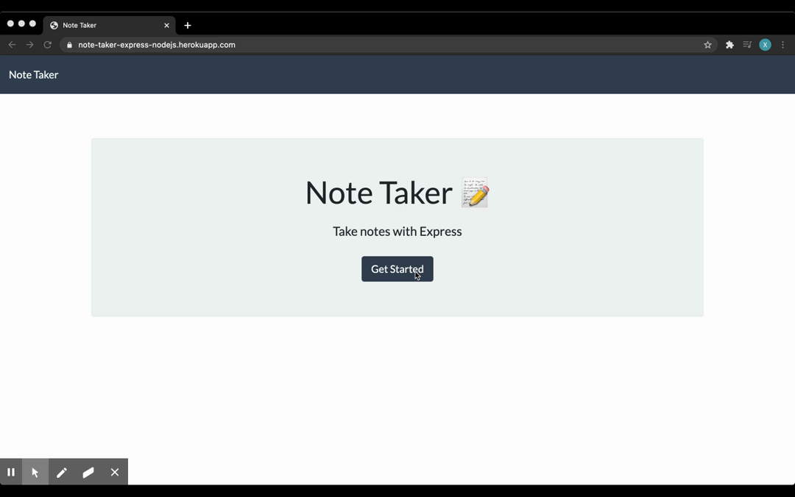

# Note Taker

## Description

This application is for users that need to keep track of a lot of information, it's easy to forget or be unable to recall something important. Being able to take persistent notes allows users to have written information available when needed. Application allows users to create and save new note; view and delete previously saved notes.

## Table of Contents

- [Deployed Application](#deployed-application)
- [Usage](#usage)
- [Installation](#installation)
- [Contributing](#contributing)
- [Tests](#tests)
- [Questions](#questions)
- [License](#license)

## Deployed Application

[Note Taker](https://note-taker-express-nodejs.herokuapp.com/)

## Usage

- GET `/notes` - return the `notes.html` file.

- GET `*` - return the `index.html` file

- The application have a `db.json` file on the backend that will be used to store and retrieve notes using the `fs` module.

- GET `/api/notes` - read the `db.json` file and return all saved notes as JSON.

- POST `/api/notes` - receive a new note to save on the request body, add it to the `db.json` file, and then return the new note to the client.

- DELETE `/api/notes/:id` - receive a query parameter containing the id of a note to delete. This means you'll need to find a way to give each note a unique `id` when it's saved. In order to delete a note, you'll need to read all notes from the `db.json` file, remove the note with the given `id` property, and then rewrite the notes to the `db.json` file.

## Installation

To install necessary dependencies, run the following command:

      npm i

## Contributing

      folk / pull

## Tests

To run test, run the follwoing command:

      npm test

## Questions

If you have any questions about the repo, open an issue or contact me directly @[xiaoyz28@uw.edu](xiaoyz28@uw.edu). You can find more of my work at [zhuxiaoyu1019](https://github.com/zhuxiaoyu1019).

## License

Copyright (c) Rita Z All rights reserved.

Licensed under the [MIT](https://choosealicense.com/licenses/mit/) license.
